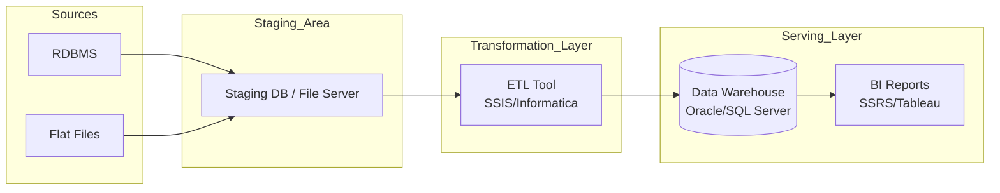
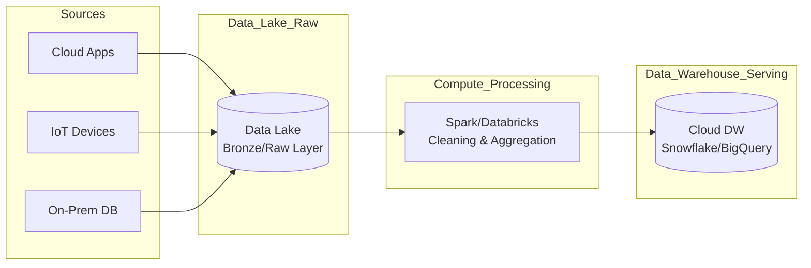
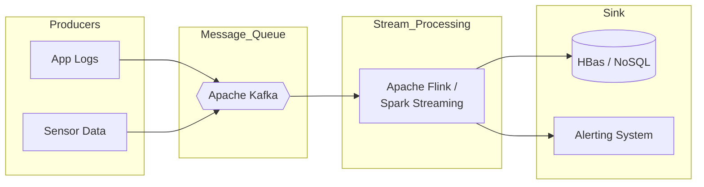
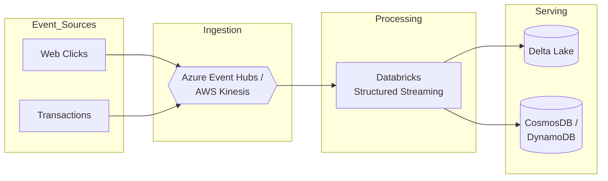

# Data Pipeline Design: Batch vs. Real-Time Streaming

This guide covers the architectural patterns for data pipelines, distinguishing between Batch and Streaming processing across On-Premise and Cloud environments.

## 1. Batch Data Pipelines
Batch processing involves collecting data over a period (e.g., daily, hourly) and processing it in large chunks. It is ideal for reporting, dashboards, and complex analytical workloads where real-time latency is not critical.

### A. On-Premise Batch Architecture (Traditional ETL)
**Pattern**: Extract -> Transform -> Load (ETL)
In traditional on-prem environments, compute and storage are often coupled (e.g., within a Data Warehouse appliance) or managed via dedicated ETL servers.

*   **Ingestion**: Files (CSV, XML) landing on a shared network drive or FTP; Database dumps.
*   **Processing (ETL)**: dedicated ETL tools like SSIS (SQL Server Integration Services), Informatica, or Talend.
*   **Storage**: Enterprise Data Warehouse (EDW) like SQL Server, Oracle Exadata, or Teradata.

### B. Cloud Batch Architecture (Modern ELT)
**Pattern**: Extract -> Load -> Transform (ELT)
Cloud architectures decouple compute and storage, allowing for raw data to be loaded immediately into a "Data Lake" before transformation. This preserves high-fidelity raw data.

*   **Ingestion**: Azure Data Factory (ADF), AWS Glue, or Airbyte.
*   **Storage (Data Lake)**: Amazon S3, Azure Data Lake Storage (ADLS) Gen2, Google Cloud Storage.
*   **Processing**: Distributed compute clusters like Databricks (Spark), Snowflake (SQL), or Google BigQuery.
*   **Serving**: Lakehouse or Cloud Data Warehouse.

---

## 2. Real-Time Streaming Pipelines
Streaming pipelines process data row-by-row or in micro-batches as soon as it is generated. This is essential for fraud detection, real-time monitoring, and live recommendations.

### A. On-Premise Streaming Architecture
Building streaming on-prem requires managing complex open-source heavyweights physically.

*   **Message Broker**: Apache Kafka is the standard for high-throughput message buffering.
*   **Stream Processing**: Apache Spark Streaming, Apache Flink, or Apache Storm.
*   **Storage**: HDFS (Hadoop), HBase, or Cassandra for fast writes.

### B. Cloud Streaming Architecture
Cloud providers offer managed services that abstract the complexity of Kafka and cluster management.

*   **Ingestion/Broker**: Amazon Kinesis, Azure Event Hubs, Google Pub/Sub.
*   **Stream Processing**: Azure Stream Analytics, AWS Kinesis Data Analytics (Flink), or Databricks Structured Streaming.
*   **Storage**: Delta Lake (for historical analysis) and NoSQL (DynamoDB/CosmosDB for hot path).

---

## Summary Comparison

| Feature | On-Premise Batch | Cloud Batch (Modern) | On-Premise Streaming | Cloud Streaming |
| :--- | :--- | :--- | :--- | :--- |
| **Primary Pattern** | ETL | ELT | Event-Driven | Event-Driven |
| **Latency** | High (Hours/Days) | Medium (Minutes/Hours) | Low (Milliseconds/Seconds) | Low (Milliseconds/Seconds) |
| **Scalability** | Fixed Hardware limits | Elastic (Auto-scaling) | Hard (Manual cluster expansion) | Elastic (Managed Services) |
| **Cost Model** | CapEx (Upfront HW) | OpEx (Pay-as-you-go) | CapEx | OpEx |
| **Key Tools** | SSIS, Informatica, Oracle | Snowflake, Databricks, ADF | Kafka, Flink, Spark | Kinesis, Event Hubs, Stream Analytics |
